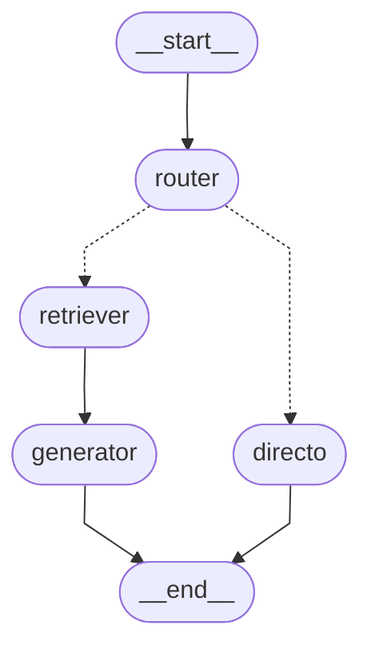
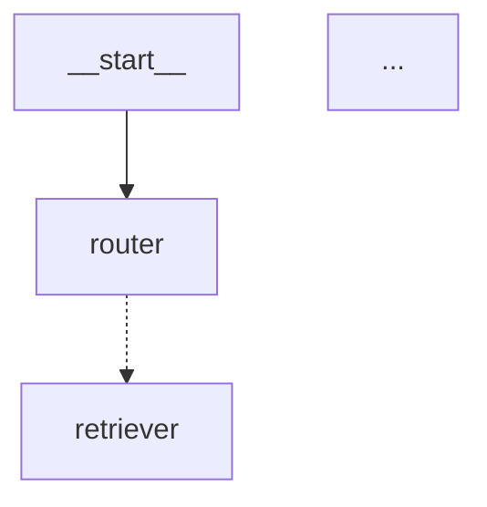

# Visualizar el grafo — Mermaid diagram

## ¿Por qué visualizar?

Un grafo con 5+ nodos y edges condicionales se vuelve difícil de razonar solo leyendo código. La visualización sirve para:
- Verificar que la estructura es la que pensabas
- Detectar edges faltantes o ciclos no intencionados
- Documentar el flujo para tu equipo

---

## Métodos disponibles

```python
graph_repr = grafo.get_graph()

# ASCII art (siempre funciona en terminal)
print(graph_repr.draw_ascii())

# Mermaid como string (para Obsidian, GitHub, etc.)
mermaid_str = graph_repr.draw_mermaid()
print(mermaid_str)

# PNG (requiere: pip install pygraphviz)
png_data = grafo.get_graph().draw_mermaid_png()
with open("grafo.png", "wb") as f:
    f.write(png_data)
```

---

## Ejemplo de Mermaid generado

Para un RAG con router, LangGraph genera algo así:

````markdown

````

Las líneas punteadas (`-.->`) son edges condicionales. Las sólidas (`-->`) son directas.

---

## Pegar en Obsidian

Obsidian soporta Mermaid nativamente. Solo pega el bloque de código:

````markdown

````

---

## xray=True — ver subgraphs internos

Si tienes nodos que internamente son subgrafos (como los agentes de LangGraph):

```python
# Ver el grafo "de superficie"
grafo.get_graph().draw_ascii()

# Ver el grafo con todos los subgraphs expandidos
grafo.get_graph(xray=True).draw_ascii()
```

---

## Introspección programática

```python
graph_repr = grafo.get_graph()

# Nodos
for node_id, node in graph_repr.nodes.items():
    print(f"Nodo: {node_id}")

# Edges
for edge in graph_repr.edges:
    tipo = "condicional" if edge.conditional else "directa"
    print(f"{edge.source} → {edge.target} ({tipo})")
```

Esto es útil para generar documentación automática o validar que el grafo tiene la estructura esperada en tests.
